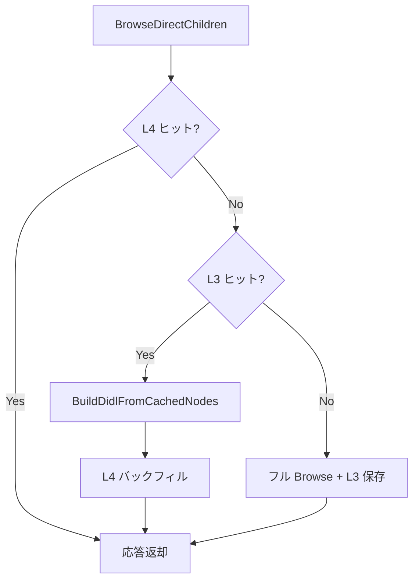

# DLNA Browse キャッシュ信頼性・画像表示 改善報告書

| 項目 | 内容 |
|------|------|
| 対象 | Jellyfin DLNA プラグイン（フォーク） |
| 前提 | [フェーズ5報告書](dlna-browse-performance-phase5-report.md)（4層キャッシュ設計の実装まで完了） |
| 目的 | Browse キャッシュ（L3/L4）のヒット率改善、画像欠落の解消、サムネイル表示速度の回復 |
| 修正範囲 | `ContentDirectory/*`, `Indexing/DlnaBrowsePrewarmService.cs`, `Profiles/DefaultProfile.cs`, `DlnaManager.cs`, 設定 UI, 単体テスト |
| 報告日 | 2026-06-24 |

---

## 1. エグゼクティブサマリー

フェーズ5で導入した **4層キャッシュ**（VirtualIndex / item_summary / BrowseNodeCache / BrowseResponseCache）は設計上は有効だが、本番運用で次の問題が顕在化した。

| 症状 | 影響 |
|------|------|
| L4 キャッシュヒット率がほぼ 0% | 毎回 DIDL XML を再生成し、初回 Browse が遅い |
| ポスター / サムネイルが表示されない | DLNA クライアントで一覧の画像が欠落 |
| サムネイル読み込みが以前より遅い | キャッシュ無効化と簡略 XML 経路停止の副作用 |

本対応では **キャッシュキーの安定化**、**loopback URL の L4 汚染防止**、**L3 高速パスのフル品質 DIDL 再生成**、**プリウォームの LAN URL 化** を実装し、キャッシュの効果と画像品質を両立した。

---

## 2. 背景・課題

### 2.1 キャッシュヒット率が上がらない

ストレージタブの統計で、Browse 回数に対し L4 エントリ数は増えるが **ヒット率が 0% 前後** となるケースがあった。

| 原因 | 説明 |
|------|------|
| `DefaultProfile` の ID が毎回 `Guid.NewGuid()` | リクエストごとにキャッシュキーの Profile 成分が変化 |
| キャッシュキーに `LibraryGeneration` / `IndexGeneration` を含めていた | 世代が変わるたびにキーが無効化され、実質ヒットしない |
| DLNA クライアントの Browse パターン | 多くの異なるフォルダを 1 回ずつ開くため、同一キーへの再アクセスが少ない |
| `BrowseMetadata` + `BrowseDirectChildren` の 2 リクエスト | フラグが異なるため L4 キーも別になる（仕様上は正常） |

### 2.2 画像が表示されない

| 原因 | 説明 |
|------|------|
| L3 ヒット時の簡略 XML | `WriteBrowseNodeElement` は `dlna:profileID` や `<res>` を含まず、一部クライアントで画像が欠落 |
| プリウォームが `http://127.0.0.1` で L4 を書き込み | 画像 URL が loopback になり、クライアントから到達不能 |
| L3 → L4 バックフィル | 簡略 XML が L4 に混入し、クライアント向け応答を劣化 |

### 2.3 サムネイル読み込みの遅延

画像欠落対策として L3 高速パスと L3→L4 バックフィルを停止した結果、**毎回フル Browse**（インデックス問い合わせ + DIDL 生成）が走り、体感速度が低下した。加えて loopback 書き込み拒否後は **プリウォームが L4 を温められなくなっていた**。

---

## 3. 実装内容

### 3.1 キャッシュキーの安定化

#### `BrowseCacheKey` の見直し

| 変更 | 理由 |
|------|------|
| `LibraryGeneration` / `IndexGeneration` をキーから削除 | 無効化は `ContentInvalidationService` が明示的に実施。キーに含めるとヒット率が下がるだけ |
| `ServerBase`（正規化済みサーバー URL）をキーに追加 | クライアントごとに異なるベース URL の DIDL を混在させない |
| `BrowseCacheKeyNormalizer` を新設 | `SortCriteria` / `Filter` / `ServerBase` の正規化を一元化 |

#### `DefaultProfile` の固定 ID

```csharp
// 修正前: リクエストごとに新しい Guid
// 修正後: 固定 ProfileId + DlnaManager.GetDefaultProfile() シングルトン
```

プロファイル未指定の DLNA リクエストでもキャッシュキーが安定する。

### 3.2 L4 キャッシュの信頼性

| 変更 | 内容 |
|------|------|
| loopback URL の書き込み拒否 | `BrowseResponseCache.Set` で `127.0.0.1` / `localhost` / `[::1]` を検出してスキップ |
| 簡略 XML の L4 バックフィル停止 | L3 からの劣化 XML が L4 を汚染しないよう削除 |

### 3.3 L3 高速パスの復活（フル品質 DIDL）

L3 ヒット時は `GetUserItems` をスキップし、キャッシュ済み `BrowseNodeRecord` から **`_didlBuilder` でフル品質 DIDL** を再生成する。



#### `BuildDidlFromCachedNodes`

- 親フォルダは `GetItemFromObjectId` で 1 回だけ解決
- 子要素は `ResolveCachedChildItems` で **item_summary をバッチ取得**（`SummaryHit` 相当の軽量経路）
- `WriteSummaryElement` / `WriteFolderElement` / `WriteItemElement` により **画像 URL・profileID を含む完全 DIDL** を生成
- キャッシュ済み `ChildCount` を再利用し、N+1 件数問い合わせを回避

### 3.4 プリウォームの LAN URL 化

`DlnaBrowsePrewarmService` が `http://127.0.0.1` 固定だった問題を修正。

| 変更 | 内容 |
|------|------|
| `INetworkManager` を注入 | SSDP 登録と同様に LAN バインドアドレスを選択 |
| `GetSmartApiUrl(bindAddress)` を使用 | Jellyfin が返す正しい API ベース URL で Browse を実行 |
| loopback は最終フォールバックのみ | LAN インターフェースが無い環境でのみ `127.0.0.1`（この場合 L4 書き込みは拒否される） |

これにより、インデックス構築後のプリウォームが **クライアント到達可能な URL** で L4 を事前投入できる。

### 3.5 childCount キャッシュの改善

| 変更 | 内容 |
|------|------|
| Estimate モードでも Browse 時に `totalCount` を書き込み | `CacheChildCountFromBrowse` を Estimate 時にも実行 |
| UI ヘルプ更新 | 「省略」モードでは childCount キャッシュが無効である旨を表示 |
| Quest 互換モード時 | childCount キャッシュチェックボックスを無効化 |

### 3.6 メトリクス・設定 UI

| 追加 | 内容 |
|------|------|
| `BrowseCacheHitKind` | `None` / `Response` (L4) / `Node` (L3) を区別 |
| `ResponseCacheHitRate` / `NodeCacheHitRate` | L3 と L4 のヒット率を分離表示 |
| `BrowseNodeCache.GetStatistics()` | L3 エントリ数・推定メモリをストレージタブに表示 |
| `ClearBrowseCache` / `ClearAll` | L3（BrowseNodeCache）も同時にクリア |

---

## 4. 変更ファイル一覧

| ファイル | 変更概要 |
|----------|----------|
| `ContentDirectory/ControlHandler.cs` | L3 フル品質再生成、childCount 書き込み、キャッシュキー構築 |
| `ContentDirectory/BrowseCacheModels.cs` | `ServerBase` をキーに追加 |
| `ContentDirectory/BrowseCacheKeyNormalizer.cs` | キー正規化・loopback 判定（新規） |
| `ContentDirectory/BrowseResponseCache.cs` | loopback 書き込み拒否 |
| `ContentDirectory/BrowseNodeCache.cs` | 統計 API |
| `ContentDirectory/BrowseMetrics.cs` | L3/L4 分離メトリクス |
| `Indexing/DlnaBrowsePrewarmService.cs` | LAN URL でプリウォーム |
| `Profiles/DefaultProfile.cs` | 固定 ProfileId |
| `DlnaManager.cs` | DefaultProfile シングルトン化 |
| `Maintenance/DlnaStorageMaintenanceService.cs` | L3 クリア対応 |
| `Configuration/config.js` / `config.html` | ストレージ統計・ヘルプ文言 |
| 単体テスト（7 ファイル） | キー正規化、メトリクス、キャッシュ動作 |

---

## 5. 運用手順

### 5.1 デプロイ後の推奨手順

1. プラグイン設定 → **ストレージ** タブ → **Browseキャッシュをクリア**（古い localhost エントリ除去）
2. 必要に応じて **インデックス再構築**（`item_summary` の画像タグを最新化）
3. よく使うフォルダを 1 回 Browse（L3/L4 のウォームアップ）
4. ストレージタブで **L3/L4 ヒット率** を確認

### 5.2 ログでの確認

```
# L4 ヒット（最速）
[DLNA Browse] ObjectId=... CacheHit=True ...

# L3 ヒット（インデックス問い合わせ省略、DIDL 再生成）
[DLNA Browse] ObjectId=... CacheHit=True ...  # BrowseCacheHitKind.Node

# プリウォーム成功
DLNA browse prewarm completed Libraries=1 Responses=25
```

### 5.3 ヒット率の見方

| 指標 | 期待値の目安 |
|------|-------------|
| インデックスヒット率 | 80% 以上（仮想フォルダ Browse 時） |
| L4 ヒット率 | 同一フォルダの再アクセスで上昇。初回探索中心の UI では低く見えることがある |
| L3 ヒット率 | L4 miss 後の再アクセス、またはインデックス再構築直後の 2 回目以降で上昇 |

DLNA クライアントが多くのフォルダを 1 回ずつ開く UI では、**絶対ヒット率は低く見える** が、再訪問フォルダでは L3/L4 の効果が出る。

### 5.4 既知の制約

| 制約 | 説明 |
|------|------|
| サーバー URL の不一致 | クライアントが IP でアクセスしプリウォームが別 IP/ホスト名の場合、L4 キーが一致しない |
| `BrowseMetadata` は別キー | メタデータ取得は L4/L3 の対象外（BrowseDirectChildren のみ） |
| loopback のみの環境 | プリウォームは L4 に書き込めない（クライアント初回 Browse はフル生成） |

---

## 6. テスト

```powershell
dotnet test Jellyfin.Plugin.Dlna.sln -c Release
```

追加・更新した主なテスト:

| テスト | 内容 |
|--------|------|
| `BrowseCacheKeyNormalizerTests` | Sort/Filter/ServerBase 正規化、loopback 判定 |
| `BrowseCacheKeyStabilityTests` | キー安定性 |
| `DefaultProfileCacheIdentityTests` | DefaultProfile の固定 ID |
| `BrowseMetricsTests` | L3/L4 分離ヒット率 |
| `BrowseResponseCacheTests` | loopback 書き込み拒否 |

**結果:** 118 件すべて合格（2026-06-24 時点）。

---

## 7. まとめ

| 項目 | 修正前 | 修正後 |
|------|--------|--------|
| L4 ヒット | キー不安定 + loopback 汚染で実質無効 | 安定キー + LAN プリウォームで有効化 |
| 画像表示 | L3 簡略 XML / localhost URL で欠落 | フル DIDL 再生成 + loopback 拒否 |
| 体感速度 | キャッシュ無効化で毎回フル Browse | L3/L4 復活で再訪問フォルダが高速化 |
| 可観測性 | 合算ヒット率のみ | L3/L4 分離 + L3 統計表示 |

4層キャッシュ設計の意図どおり、**インデックス（層1/2）で問い合わせを省略し、層3/4 で DIDL 生成を省略**する経路が、画像品質を損なわずに機能するようになった。
