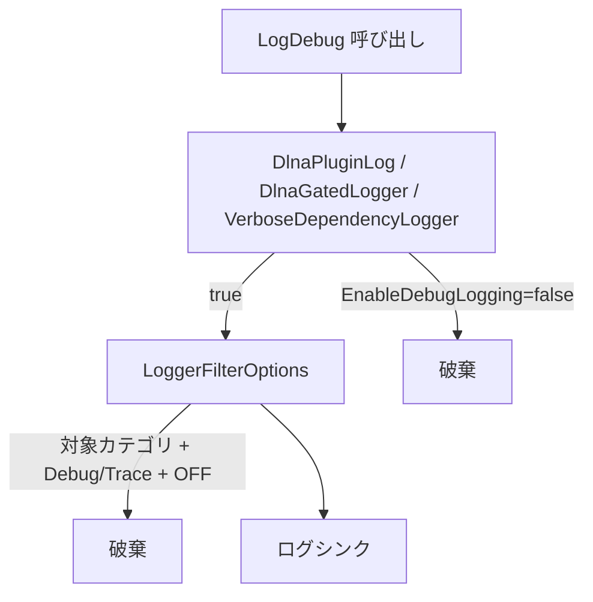

# DLNA ストレージ管理・デバッグログ制御 実装報告書

| 項目 | 内容 |
|------|------|
| 対象 | Jellyfin DLNA プラグイン（フォーク） |
| 前提 | [フェーズ4報告書](dlna-browse-performance-phase4-report.md)（階層 Browse インデックスまで完了） |
| 目的 | 本番運用向けにキャッシュ/インデックス DB の可視化・メンテナンスを可能にし、デフォルト OFF のデバッグログでログ肥大化を防ぐ |
| 修正範囲 | `Maintenance/*`, `DlnaPluginLog` 系, 設定 UI, `DlnaController` API, `DidlBuilder`, 単体テスト |
| 報告日 | 2026-06-24 |

---

## 1. エグゼクティブサマリー

Browse 高速化（フェーズ1〜4）に伴い、SQLite インデックス DB・Browse XML キャッシュ・childCount キャッシュが増加する。本対応では **プラグイン設定画面から容量・件数を確認し、選択的にクリア・再構築できる API/UI** を追加した。

あわせて、本番では不要な `[DBG]` ログ（SOAP 制御 XML、`StreamBuilder.BuildVideoItem` 等）が `logging.json` 設定や Browse プリウォームで大量出力される問題に対し、**プラグイン設定 `EnableDebugLogging`（デフォルト OFF）による二重防御のログ制御** を導入した。

---

## 2. 背景・課題

### 2.1 ストレージ可視化

| 課題 | 内容 |
|------|------|
| 容量不透明 | `dlna-index.db` やメモリキャッシュの実サイズが設定画面から分からない |
| 運用困難 | インデックス破損・設定変更後のクリア手段がタスク実行のみ |
| トラブルシュート | Browse ヒット率（CacheHit / IndexHit）の集計がログ解析依存 |

### 2.2 デバッグログ肥大化

| 課題 | 内容 |
|------|------|
| SOAP/XML ログ | `BaseControlHandler` が Browse ごとに制御リクエスト/レスポンスを `LogDebug` |
| Jellyfin 本体ログ | `DidlBuilder` → `StreamBuilder` が `ContentDirectoryService` カテゴリで `BuildVideoItem` を DBG 出力 |
| プリウォーム時の爆発 | `DlnaBrowsePrewarmService` が数百件の Browse を実行し、DBG が連続出力 |
| 設定のすり抜け | `DlnaPluginLog` の呼び出し元ゲートだけでは、直接 `LogDebug` や Jellyfin 本体コードを遮断できない |
| `logging.json` 優先 | 本体で `Jellyfin.Plugin.Dlna: Debug` が有効だとプラグイン設定と無関係に DBG が出る |

---

## 3. 実装内容

### 3.1 ストレージ / キャッシュ管理

#### API（`DlnaController`）

| エンドポイント | 動作 |
|----------------|------|
| `GET /Dlna/Storage/Stats` | インデックス DB・Browse キャッシュ・childCount・Browse メトリクスを返却 |
| `POST /Dlna/Storage/ClearBrowseCache` | Browse XML キャッシュのみクリア |
| `POST /Dlna/Storage/ClearChildCountCache` | childCount キャッシュのみクリア |
| `POST /Dlna/Storage/ClearIndex` | SQLite インデックス DB を削除 |
| `POST /Dlna/Storage/ClearAll` | 上記すべてクリア |
| `POST /Dlna/Storage/RebuildIndex` | インデックス再構築（＋設定 ON 時プリウォーム） |
| `POST /Dlna/Storage/ClearAndRebuild` | 全クリア後に再構築 |

`[Route("Dlna")]` を `DlnaController` に付与し、Jellyfin プラグイン API として正しくルーティング。

#### サービス（`DlnaStorageMaintenanceService`）

- 各ストアの `GetStatistics()` を集約して `DlnaStorageStatsDto` を生成
- メンテナンス中フラグで並行実行を防止
- 再構築時は `IDlnaVirtualIndexService` + オプションで `IDlnaBrowsePrewarmService` を呼び出し

#### 設定 UI（`config.html` / `config.js`）

- **ストレージ / キャッシュ管理** セクションを追加（日本語・英語）
- API レスポンスの camelCase / PascalCase 両対応（`normalizeStorageStats()`）
- エラー表示・メンテナンス中のボタン無効化

#### 統計インターフェース拡張

| コンポーネント | 追加統計 |
|----------------|----------|
| `VirtualIndexStore` | DB パス、ファイルサイズ、各テーブル件数 |
| `BrowseResponseCache` | エントリ数、推定バイト数、ライブラリ別内訳 |
| `ChildCountCache` | エントリ数 |
| `BrowseMetrics` | Browse 回数、CacheHit率、IndexHit率、無効化回数 |

### 3.2 デバッグログ制御（二重防御）

#### 第1層：呼び出し元ゲート

| コンポーネント | 役割 |
|----------------|------|
| `DlnaDebugLoggingState` | `EnableDebugLogging` のスレッドセーフキャッシュ（DI シングルトン） |
| `DlnaPluginLog` | プラグイン内の `LogDebug` / `[DLNA Browse]` をゲート |
| `DlnaGatedLogger` | SSDP（`SsdpCommunicationsServer`）向け `ILogger` ラッパー |
| `DlnaPluginLog.VerboseDependencyLogger` | Jellyfin 本体 `StreamBuilder` 等に `NullLogger` を渡して DBG 抑制 |

`StreamBuilder` 修正箇所:

- `DidlBuilder.cs`（動画・音声ストリーム決定）
- `PlayToSession.cs`（PlayTo 再生リスト）

#### 第2層：パイプラインフィルタ

| コンポーネント | 役割 |
|----------------|------|
| `DlnaLoggingCategories` | `Jellyfin.Plugin.Dlna*`, `Rssdp`, `System.Net.Http.HttpClient.Dlna` |
| `DlnaLoggingFilter` | カテゴリ + レベル判定 |
| `DlnaServiceRegistrator` | `LoggerFilterOptions` にフィルタ登録 |

> **注:** Jellyfin ホストのログ初期化タイミングにより、第2層が効かない環境がある。第1層 + `VerboseDependencyLogger` が実運用の主要防御線。

#### 設定同期（即時反映）

| タイミング | 処理 |
|------------|------|
| `DlnaDebugLoggingInitializer`（起動時） | `SyncFrom(Configuration)` |
| `DlnaPlugin.UpdateConfiguration`（保存直後） | `SyncFrom` |
| `DlnaPluginConfigurationMonitor`（`ConfigurationUpdated`） | `SyncFrom` + キャッシュ無効化 |

`DlnaServiceRegistrator` では `DlnaPlugin.Instance` が未初期化の場合があるため、null ガード後に登録（DI 全体の失敗を防止）。

### 3.3 設定項目

| 設定 | デフォルト | 説明 |
|------|------------|------|
| `EnableDebugLogging` | `false` | SOAP/XML・Browse 計測・SSDP 詳細ログ |

---

## 4. 不具合修正（実装過程）

| 症状 | 原因 | 対応 |
|------|------|------|
| 設定 UI に容量が表示されない | `DlnaController` に `[Route("Dlna")]` がなく API 404 | ルート属性追加、`config.js` の正規化・エラー表示 |
| DBG が OFF でも `StreamBuilder.BuildVideoItem` が出力 | Jellyfin 本体が `LogDebug` を直接呼ぶ | `VerboseDependencyLogger` で `NullLogger` を注入 |
| `IDlnaManager` 解決エラー（SUBSCRIBE 失敗） | `RegisterServices` 時に `DlnaPlugin.Instance` が null で例外 | 同期前に null ガード |

---

## 5. テスト

`dotnet test Jellyfin.Plugin.Dlna.sln -c Release` — **68 件合格**（本対応追加分を含む）

| テストファイル | 内容 |
|----------------|------|
| `DlnaLoggingFilterTests` | カテゴリ判定、state 切替、フィルタ、`DlnaGatedLogger`、`VerboseDependencyLogger` |
| `DlnaStorageMaintenanceServiceTests` | 統計取得・クリア・再構築 |
| `VirtualIndexStoreStatisticsTests` 等 | 各ストア統計 |

---

## 6. 動作確認手順

### ストレージ管理

1. ダッシュボード → プラグイン → DLNA → **ストレージ / キャッシュ管理**
2. インデックス DB サイズ・キャッシュ件数が表示されること
3. **Browse キャッシュをクリア** → 件数が 0 に近づくこと
4. **インデックスを再構築** → ログに `DLNA index warmup completed`

### デバッグログ

1. **デバッグログを有効にする = OFF** で保存
2. Browse / プリウォーム実行
3. `[DBG] ... ContentDirectoryService: StreamBuilder.BuildVideoItem` が **出ない**こと
4. `[INF] DLNA browse prewarm completed` / `DLNA index warmup completed` は **出る**こと
5. デバッグ ON → 保存 → SOAP/XML・`[DLNA Browse]` 行が出ること（再起動不要）

---

## 7. スコープ外（後続候補）

| 項目 | 状態 |
|------|------|
| Jellyfin ホスト全体への `LoggerFilterOptions` 強制適用 | プラグイン API 制約のため未保証 |
| ストレージ自動クリーンアップ（容量上限） | 未実装 |
| Browse メトリクスのダッシュボードグラフ化 | 未実装 |

---

## 8. 関連ドキュメント

- [README.ja.md](../README.ja.md)
- [VSCode タスクガイド](vscode-tasks-guide.ja.md)
- [フェーズ1〜4 報告書](dlna-browse-performance-phase1-report.md)
