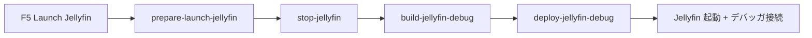
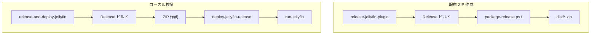

# VSCode タスクガイド（ビルド・デプロイ・リリース）

Jellyfin DLNA プラグインの VSCode タスクは、すべて [`scripts/dev.ps1`](../scripts/dev.ps1) を呼び出す薄いラッパーです。  
実処理は PowerShell 側に集約されており、[`.vscode/tasks.json`](../.vscode/tasks.json) は「どの順番で何を実行するか」を定義しています。

## 最初に読む：どれを使えばいいか

| やりたいこと | 使うタスク | 成果物 |
|-------------|-----------|--------|
| **GitHub / 本番サーバーへ配布する ZIP を作る** | **`release-jellyfin-plugin`** | `dist/jellyfin-plugin-dlna_<version>.zip` |
| ローカル Jellyfin で Release ビルドを試す | `release-and-deploy-jellyfin` | 上記 ZIP + ローカル `data/plugins/` へ配置 |
| 日常のプラグイン開発（F5 デバッグ） | **Launch Jellyfin**（`launch.json`） | Debug ビルド → ローカル配置 |
| ビルドだけ（Release） | `publish-jellyfin-release` | `src/.../bin/Release/net9.0/` |
| ビルドだけ（Debug） | `build-jellyfin-debug` | `src/.../bin/Debug/net9.0/` |

**リリース用 ZIP が欲しいときは `release-jellyfin-plugin` 一択**です。  
`publish-jellyfin-release` や `package-jellyfin-release` は途中工程用で、ZIP まで作るなら `release-jellyfin-plugin` で足ります。

---

## 前提設定

[`.vscode/settings.json`](../.vscode/settings.json) にローカル Jellyfin のパスを設定します（デプロイ・起動タスクで使用）。

| キー | 用途 |
|------|------|
| `jellyfin.exe` | Jellyfin 実行ファイル |
| `jellyfin.workingDir` | 作業ディレクトリ |
| `jellyfin.dataDir` | データディレクトリ（プラグインは `data/plugins/DLNA_<version>/` へコピー） |
| `jellyfin.cacheDir` | キャッシュディレクトリ |

バージョンとプラグイン ID は [`build.yaml`](../build.yaml) から読み取ります。  
リリース前に `version` を更新してください。

---

## タスク一覧（全 14 個）

### リリース系（配布パッケージ）

| タスク名 | 処理内容 | 備考 |
|---------|---------|------|
| **`release-jellyfin-plugin`** | Release ビルド → ZIP 作成 | **配布用の定番タスク** |
| `package-jellyfin-release` | ZIP 作成のみ | 事前に Release ビルドが必要 |
| `publish-jellyfin-release` | Release ビルドのみ | ZIP は作らない |
| `publish-jellyfin-compat-matrix` | Release ビルドのみ | **`publish-jellyfin-release` と同一処理**（重複） |
| `open-release-folder` | `dist/` をエクスプローラーで開く | ZIP 作成後の確認用 |

**リリース成果物の場所**

```
dist/
  DLNA_<version>.0.0.0/     # 展開済みプラグインフォルダ（DLL + meta.json）
  jellyfin-plugin-dlna_<version>.0.0.0.zip   # 配布用 ZIP
```

`package-release.ps1` が `build.yaml` の `artifacts` に列挙された DLL と `meta.json` をまとめます。

---

### ローカル開発・デバッグ系

| タスク名 | 処理内容 | 備考 |
|---------|---------|------|
| `build-jellyfin-debug` | Debug ビルド | F5 の前処理の一部 |
| `deploy-jellyfin-debug` | Debug 成果物を `data/plugins/` へコピー | `meta.json` も生成 |
| `prepare-launch-jellyfin` | stop → build-debug → deploy-debug | **F5「Launch Jellyfin」の preLaunchTask** |
| `restart-jellyfin` | stop → deploy-debug → run | Debug 再デプロイ＋再起動 |
| `stop-jellyfin` | 実行中の Jellyfin を終了 | |
| `run-jellyfin` | Jellyfin を起動 | |
| `open-jellyfin-log` | 最新ログを tail 表示 | ターミナルが占有される |

**F5 デバッグの流れ**



> **注意:** Debug デプロイでは PDB もコピーされます。設定 UI（`config.html` / `config.js`）は DLL に埋め込まれるため、**変更後は必ずビルド＋デプロイ**が必要です。

---

### ローカルで Release を試す系

| タスク名 | 処理内容 | 備考 |
|---------|---------|------|
| `deploy-jellyfin-release` | Release 成果物を `data/plugins/` へコピー | 事前に Release ビルドが必要 |
| **`release-and-deploy-jellyfin`** | release → stop → deploy-release → run | Release 一式をローカル検証 |



---

## 重複・紛らわしい名前について

現在のタスク定義で知っておくとよい点です。

| 状況 | 説明 |
|------|------|
| `publish-jellyfin-release` と `publish-jellyfin-compat-matrix` | `dev.ps1` 上は**どちらも Release ビルドのみ**。名前だけ異なる重複です。 |
| `publish-jellyfin-release` の「publish」 | `dotnet publish` ではなく **`dotnet build -c Release`** です。 |
| `package-jellyfin-release` vs `release-jellyfin-plugin` | 後者は前者に Release ビルドを足したもの。通常は後者を使う。 |
| `restart-jellyfin` vs `release-and-deploy-jellyfin` | 前者は **Debug** 再デプロイ、後者は **Release** 再デプロイ。 |

**整理した運用（推奨）**

- 配布 ZIP → `release-jellyfin-plugin`
- ローカル Release 確認 → `release-and-deploy-jellyfin`
- 開発 → F5（`prepare-launch-jellyfin`）
- 上記以外の `publish-*` / `package-*` は、CI や手動の部分実行用として残しているだけと考えてよい

---

## タスクの実行方法

### VSCode から

1. `Ctrl+Shift+P` → **「Tasks: Run Task」**
2. 一覧からタスク名を選択

ビルド系は `Ctrl+Shift+B`（**Run Build Task**）でも実行できますが、デフォルトビルドは `build-jellyfin-debug` のみです。リリース ZIP には使えません。

### ターミナルから（同等コマンド）

```powershell
pwsh -File scripts/dev.ps1 release-jellyfin-plugin
pwsh -File scripts/dev.ps1 release-and-deploy-jellyfin
pwsh -File scripts/dev.ps1 build-jellyfin-debug
```

---

## リリース手順（チェックリスト）

1. [`build.yaml`](../build.yaml) の `version` と `changelog` を更新
2. VSCode で **`release-jellyfin-plugin`** を実行
3. **`open-release-folder`** で `dist/` を確認
4. `dist/jellyfin-plugin-dlna_*.zip` を GitHub Releases 等にアップロード
5. （任意）ローカルで **`release-and-deploy-jellyfin`** を実行し、Release ビルドの動作確認

---

## 関連ファイル

| ファイル | 役割 |
|---------|------|
| [`.vscode/tasks.json`](../.vscode/tasks.json) | タスク定義 |
| [`.vscode/launch.json`](../.vscode/launch.json) | F5 デバッグ設定 |
| [`.vscode/settings.json`](../.vscode/settings.json) | ローカル Jellyfin パス |
| [`scripts/dev.ps1`](../scripts/dev.ps1) | ビルド・デプロイ・起動の実装 |
| [`scripts/package-release.ps1`](../scripts/package-release.ps1) | ZIP / `meta.json` 生成 |
| [`build.yaml`](../build.yaml) | プラグインメタデータ・バージョン |

> [`.vscode/scripts/launcher.ps1`](../.vscode/scripts/launcher.ps1) は Jellyfin/Emby 本体向けの別用途スクリプトで、**現在の `tasks.json` からは呼ばれません**。

---

## トラブルシュート

| 症状 | 確認すること |
|------|-------------|
| 設定 UI が古いまま | Debug/Release ビルド後に deploy タスクを実行したか。F5 なら `prepare-launch-jellyfin` が走る。 |
| `deploy-*` が失敗 | `settings.json` の `jellyfin.dataDir` が正しいか。先にビルドタスクを実行したか。 |
| ZIP が作られない | `release-jellyfin-plugin` を使っているか。`build.yaml` の `artifacts` に DLL が列挙されているか。 |
| Jellyfin が起動しない | `jellyfin.exe` のパス、ポート競合、ログ（`open-jellyfin-log`）を確認。 |
